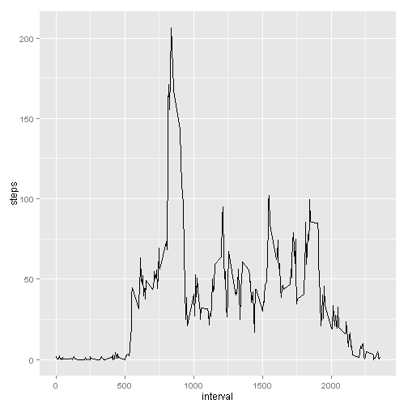

## Loading and preprocessing the data

Load the data


```r
activity_data<-read.csv("activity.csv", header = TRUE, sep = ",")
```

Process/transform the data (if necessary) into a format suitable for your analysis


```r
activity_data <- transform(activity_data, date = as.Date(date))
```

## What is mean total number of steps taken per day?

Make a histogram of the total number of steps taken each day


```r
suma <- tapply(activity_data$steps, activity_data$date, sum)
barplot(suma, xlab="Date", ylab="Total Steps", col="red")
```

 

Calculate and report the mean and median total number of steps taken per day


```r
mean(as.integer(suma),na.rm = TRUE)
```

```
## [1] 10766.19
```

```r
median(as.integer(suma),na.rm = TRUE)
```

```
## [1] 10765
```

## What is the average daily activity pattern?

Make a time series plot (i.e. type = "l") of the 5-minute interval (x-axis) and the average number of steps taken, averaged across all days (y-axis)


```r
media <- tapply(activity_data$steps, activity_data$interval, mean, na.rm = TRUE)
plot(media, type="l", xlab="5-minute interval ", ylab="Average number of steps taken", col="red" , lwd=2)
```

 


Which 5-minute interval, on average across all the days in the dataset, contains the maximum number of steps?


```r
media[which(as.numeric(media)==max(as.numeric(media)))]
```

```
##      835 
## 206.1698
```

## Imputing missing values

Calculate and report the total number of missing values in the dataset (i.e. the total number of rows with NAs)


```r
sum(!complete.cases(activity_data))
```

```
## [1] 2304
```

Devise a strategy for filling in all of the missing values in the dataset. The strategy does not need to be sophisticated. For example, you could use the mean/median for that day, or the mean for that 5-minute interval, etc.

The strategy will be to fill The missing values with 0's because the missing values could have been generated because of malfunction in the device.

Create a new dataset that is equal to the original dataset but with the missing data filled in.


```r
activity_data_filled<-activity_data
activity_data_filled[!complete.cases(activity_data),"steps"]<-0
```

Make a histogram of the total number of steps taken each day and Calculate and report the mean and median total number of steps taken per day. 


```r
suma1 <- tapply(activity_data_filled$steps, activity_data_filled$date, sum)
barplot(suma1, xlab="Date", ylab="Total Steps", col="green")
```

 

```r
mean(as.integer(suma1))
```

```
## [1] 9354.23
```

```r
median(as.integer(suma1))
```

```
## [1] 10395
```

Do these values differ from the estimates from the first part of the assignment? What is the impact of imputing missing data on the estimates of the total daily number of steps?

The values differ. The mean and the median are lower but similar.

The impact of imputing missing data on the estimates of the total daily number of steps is only relative.

## Are there differences in activity patterns between weekdays and weekends?

Create a new factor variable in the dataset with two levels - "weekday" and "weekend" indicating whether a given date is a weekday or weekend day


```r
wday<-weekdays(activity_data$date)
wday[wday=="lunes"|wday=="martes"|wday=="miércoles"|wday=="jueves"|wday=="viernes"]<-"weekday"
wday[wday=="sábado"|wday=="domingo"]<-"weekend"
#create factor
wday<-factor(wday)
#add fafctor to data frame
activity_data<-cbind(wday, activity_data)
```

Make a panel plot containing a time series plot (i.e. type = "l") of the 5-minute interval (x-axis) and the average number of steps taken, averaged across all weekday days or weekend days (y-axis). See the README file in the GitHub repository to see an example of what this plot should look like using simulated data.


```r
df <- as.data.frame(xtabs(steps~interval+wday, data=activity_data))
library(ggplot2)
qplot(Freq, interval, data=df, facets = . ~ wday, xlab="Average number of steps taken",ylab="5-minute interval")+coord_flip()
```

 

We can conclude that there are differences in activity patterns between weekdays and weekends.

